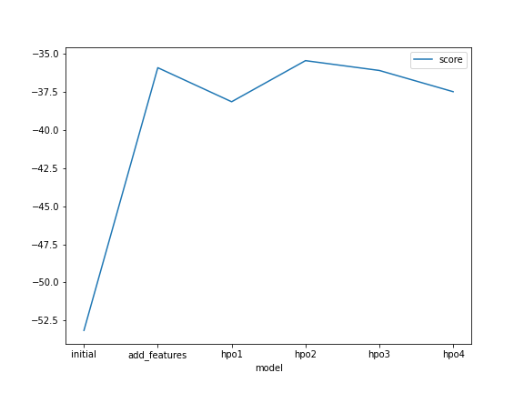
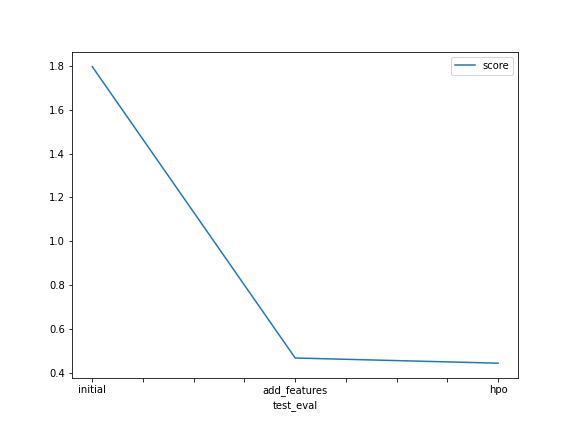

# Report: Predict Bike Sharing Demand with AutoGluon Solution
#### HARSHIT SAINI

## Initial Training
### What did you realize when you tried to submit your predictions? What changes were needed to the output of the predictor to submit your results?
The output needed to be in format of Samplesubmission.csv and added in "count" column and no output values could be negative.So, all the negative values were reformatted as '0'.

### What was the top ranked model that performed?
The top ranked model was always a "WeightedEnsemble" model made up of different base models like KNN, RandomForest, etc.

## Exploratory data analysis and feature creation
### What did the exploratory analysis find and how did you add additional features?
Some columns that could perform better as "Category" types were in "int" so they needed to be converted to "Category". Additional features were created by splitting the "datetime" column into separate columns of "day","month","year" and "hours".

### How much better did your model preform after adding additional features and why do you think that is?
After adding additional features the model performed exponentionally better. The Kaggle score went from "1.79711" to "0.46695". This improvement could be attributed to the fact that after splitting the "datetime column", the added columns were easier to train from by the models and infer due to their simple format of int type.

## Hyper parameter tuning
### How much better did your model preform after trying different hyper parameters?
Many different hyperparameter tuning was applied, the best hpo model gave Kaggle score of "0.44339" which was better than before.

### If you were given more time with this dataset, where do you think you would spend more time?
Trying more combinations of the different hyperparameters and probably making advanced model based on Neural Networks to get better results.

### Create a table with the models you ran, the hyperparameters modified, and the kaggle score.
|model|time_limit|auto_stack|hyperparameters_of_individualmodels|score|
|--|--|--|--|--|
|initial|600|False|NoneNone|1.79711|
|add_features|600|False|None|0.46695|
|hpo1|3600|True|None|0.46367|
|hpo2|7200|False|Given|0.44339|

### Create a line plot showing the top model score for the three (or more) training runs during the project.

TODO: Replace the image below with your own.

### Create a line plot showing the top kaggle score for the three (or more) prediction submissions during the project.

TODO: Replace the image below with your own.

## Summary
Overall, the autogluon worked very efficiently. After analyzing tje leaderboard of the Kaggle competition, it was observed that the Kaggle score obtained could place in top 1000 of the leaderboard even though the time taken to make the model was surely very less than other models. The hyperparameter tuning and feature addition helped a lot in improving score and making the model much better. Further improvement may be observed using Neural Networks and more Hyperparameter tuning.
